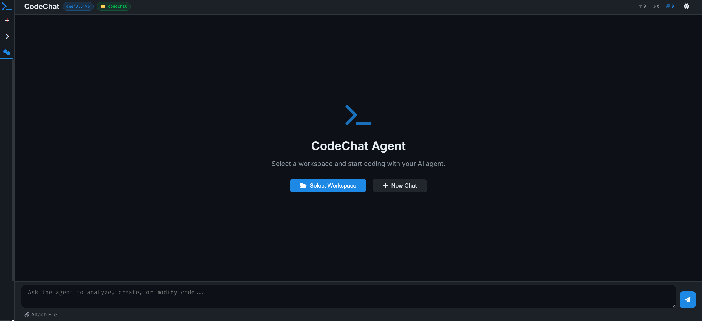

# CodeChat Agent

A local AI coding agent powered by Ollama (Qwen 3.5 9B) that works directly on your filesystem. Pick any repo, browse its files, feed them as context, and let the AI read, reason about, and write code changes straight to disk.



## Why This Exists

- **No cloud, no API keys** — runs 100% local on Ollama
- **Full filesystem access** — browse drives, navigate folders, open any file
- **Real agent workflow** — AI sees your project tree, reads files you select, and writes changes back with one click
- **Qwen 3.5 9B optimized** — strips `<think>` tokens, structured agent prompts, tuned for local models
- **Context you control** — right-click files or entire folders to load them into the conversation; remove anytime

## Core Capabilities

- **Workspace selection** — folder picker with drive listing, sets the working directory for the AI
- **File explorer** — sidebar tree with types, sizes, click-to-view, right-click to add context
- **Folder context** — right-click a folder to recursively add all its text files (up to 50, skips binaries)
- **Apply to disk** — AI code blocks with file paths get an "Apply" button that writes directly
- **Image viewer** — click any image in the file tree for a lightbox preview; inline images in chat
- **Markdown chat** — full Markdown rendering with syntax-highlighted code blocks, copy buttons
- **Persistent history** — SQLite stores all conversations, messages, contexts, artifacts, and token counts
- **Dark/light theme** — dark by default, one-click toggle

## Setup

```bash
python -m venv venv
venv\Scripts\activate        # Windows
# source venv/bin/activate   # macOS/Linux
pip install -r requirements.txt
python app.py
```

Open `http://localhost:5000`

Requires [Ollama](https://ollama.com) running locally with a model pulled:

```bash
ollama pull qwen3.5:9b
```

Override defaults with a `.env` file:

```
OLLAMA_BASE_URL=http://localhost:11434/v1
OLLAMA_MODEL=qwen3.5:9b
```

## Project Structure

```
codechat/
├── app.py              # Flask backend — endpoints, agent logic, file system access
├── database.py         # SQLite — conversations, messages, contexts, artifacts
├── static/
│   ├── script.js       # Frontend — file tree, workspace, chat, lightbox
│   └── style.css       # Styles — themes, file explorer, modals
├── templates/
│   └── index.html      # HTML layout, modals, templates
├── requirements.txt
├── CHANGELOG.md
└── README.md
```

## API Endpoints

| Method | Path | Description |
|--------|------|-------------|
| `GET` | `/` | Main UI |
| `POST` | `/process` | Send prompt to AI |
| `POST` | `/new-conversation` | Create conversation (with optional workspace) |
| `GET` | `/load-conversation/<id>` | Load conversation |
| `POST` | `/rename-conversation` | Rename |
| `POST` | `/delete-conversation` | Soft-delete |
| `GET` | `/drives` | List available drives |
| `GET` | `/browse?path=...` | Browse directory |
| `GET` | `/read-file?path=...` | Read file content |
| `POST` | `/write-file` | Write content to file |
| `POST` | `/set-workspace` | Set workspace for conversation |
| `POST` | `/add-file-context` | Add file to context |
| `POST` | `/add-folder-context` | Add folder (recursive) to context |
| `POST` | `/remove-file-context` | Remove from context |
| `GET` | `/workspace-image?path=...` | Serve image file |

## Keyboard Shortcuts

| Key | Action |
|-----|--------|
| `Ctrl+N` | New conversation |
| `Ctrl+/` | Toggle sidebar |
| `Esc` | Close modals/lightbox |

## License

MIT
